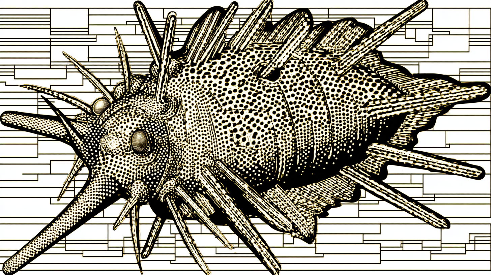

# Plankton



Real-time code quality enforcement for AI coding agents, built on Claude Code hooks.

> [!CAUTION]
> Research project under active development. Hooks are tested against
> Claude Code >= 2.1.50 (see badge). Newer CC versions usually work
> but are not guaranteed. **Disable CC auto-updates** to prevent
> silent breakage (see Quick Start). If you encounter issues, file a
> report including the output of `claude --version`. To pin to a
> specific Plankton version: `git checkout v0.1.0`.

## quick start

```bash
git clone https://github.com/alexfazio/plankton.git
cd plankton
pip install uv && uv sync --all-extras
claude                # hooks activate automatically
```

That's it. Plankton works by being the directory you run Claude Code from.
The hooks in `.claude/hooks/` are picked up automatically — no install
command, no plugin, no config. Clone, cd, claude.

> [!TIP]
> You can work on any codebase from inside plankton. Just tell Claude:
> *"work on /path/to/my-project"* — it will apply the same quality
> enforcement to that codebase while the hooks stay active.

> [!NOTE]
> **Existing codebases:** the agent edits a file, Plankton enforces every
> violation in it, pre-existing included. Messy files get cleaned up on first
> touch. After that, they're fast. Scope it down with exclusions:
>
> ```json
> "exclusions": ["tests/", "legacy/", "vendor/", "node_modules/"]
> ```

**Recommended: disable Claude Code auto-updates.** Plankton depends on
undocumented CC internals — a silent auto-update can break hooks without
warning.

```bash
# Option A: disable auto-updates entirely (most reliable)
echo 'export DISABLE_AUTOUPDATER=1' >> ~/.zshrc && source ~/.zshrc

# Option B: use the stable channel (~1 week behind latest, fewer regressions)
curl -fsSL https://claude.ai/install.sh | bash -s stable
```

Only `jaq` and `ruff` are required. Everything else is optional and
gracefully skipped if not installed. See [docs/SETUP.md](docs/SETUP.md)
for per-language installation and configuration.

## what is plankton

Code quality gate enforcement at write-time, using Claude Code hooks. The
agent is blocked from proceeding until its output passes your checks —
style, types, security, complexity — all enforced before commits and code
review.

- **Higher pass rate** — write-time feedback catches bugs, type errors,
  and anti-patterns that would otherwise cause test failures.
- **Behavioral shift** — with Plankton active, the model learns from
  write-time feedback and produces better code *during* generation,
  not just through post-hoc formatting.
- **Compound quality** — improvements across multiple dimensions
  compound into code that is more likely to be functionally correct.

For the full motivation and design story, read the
[original writeup](https://x.com/alxfazio/status/2024931367612743688).

## verify

```bash
# Install pre-commit hooks (optional but recommended)
uv run pre-commit install

# Run the hook self-test suite
.claude/hooks/test_hook.sh --self-test
```

## how it works

Three phases run on every file edit: auto-format first (ruff, shfmt, biome,
taplo, markdownlint), then collect remaining violations as structured JSON from
20+ linters, then delegate what's left to dedicated Claude subprocesses that
reason about each fix. Config files are tamper-proof — a PreToolUse hook blocks
linter config edits before they happen. Model routing right-sizes intelligence
to problem complexity so tokens aren't wasted on easy fixes.

See [docs/REFERENCE.md](docs/REFERENCE.md) for the full architecture, message
flows, and configuration reference. For the motivation and design story, read
the [original writeup](https://x.com/alxfazio/status/2024931367612743688).

## what it enforces

Style enforcement covers formatting, import ordering, naming
conventions, docstring format, quote style, indentation, trailing
commas, modern syntax idioms (Python 3.11+ f-strings, modern type
annotations). Most of this is handled silently by auto-formatting in
Phase 1. You never see these violations because they're fixed before
they're reported.

Correctness checks catch unused variables, type errors (ty), dead
code (vulture, Knip), security vulnerabilities (bandit, Semgrep),
async anti-patterns (flake8-async), Pydantic model validation,
duplicate code detection (jscpd), ShellCheck semantic analysis with
all optional checks enabled, Dockerfile best practices (hadolint at
maximum strictness), YAML strictness with all 23 yamllint rules
configured. Phase 2 linters catch these; Phase 3 Claude instances
fix them.

Architectural constraints are emerging: complexity limits (cyclomatic
complexity, max arguments, max nesting depth, max statements per
function), package manager compliance (blocks pip/npm/yarn, enforces
uv/bun), config file protection with tamper-proof defense. These
shape how code is organized rather than how it looks.

## configuration

`.claude/hooks/config.json` controls everything: language toggles, phase
control, model routing patterns, protected files, exclusions, jscpd
thresholds, package manager enforcement modes. If the file is missing, all
features are enabled with sensible defaults. Environment variables
(`HOOK_SKIP_SUBPROCESS=1`, `HOOK_SUBPROCESS_TIMEOUT`) override config values
for quick session-level tweaks. Every rule is customizable. Configure what
gets enforced, how strictly, and for which languages. Full configuration
reference in [docs/REFERENCE.md](docs/REFERENCE.md).

## faq

See [docs/FAQ.md](docs/FAQ.md) for answers to common questions: how this
differs from pre-commit hooks, whether models will make this unnecessary, why
agents modify linting rules, and more.

## todos

- should have an install wizard instead of manual setup, a guided script that
  detects your stack and configures everything
- one-click install via Claude Code marketplace would be nice
- a Claude Code skill for configuration and troubleshooting from inside a
  session
- Swift and Go are next
- model routing currently assumes Anthropic models, need to support any model
  Claude Code supports (Qwen, DeepSeek, Gemini, etc.) with a generic
  three-tier system users map to their provider
- per-directory rule overrides, team config profiles
- extend beyond code to catch AI writing slop in docs and READMEs
  ([slop-guard](https://github.com/eric-tramel/slop-guard) integration)
- `multi_linter.sh` is ~1,300 lines and should split into one file per hook type
- 103-test integration suite exists but needs work; Claude subprocess
  stochasticity makes deterministic assertions hard
- measuring LLM+Plankton vs LLM-alone would be useful but needs benchmarking
  expertise, contributions welcome here

Contributions are welcome.

## star history

<!-- markdownlint-disable MD033 MD013 -->
<a href="https://star-history.com/#alexfazio/plankton&Date">
 <picture>
   <source media="(prefers-color-scheme: dark)" srcset="https://api.star-history.com/svg?repos=alexfazio/plankton&type=Date&theme=dark" />
   <source media="(prefers-color-scheme: light)" srcset="https://api.star-history.com/svg?repos=alexfazio/plankton&type=Date" />
   
 </picture>
</a>
<!-- markdownlint-enable MD013 -->
<!-- markdownlint-enable MD033 -->

## license

MIT
