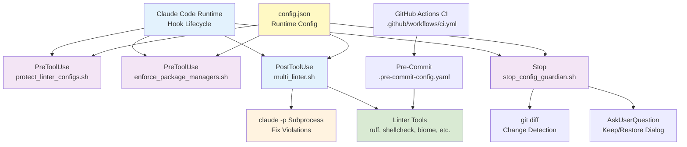
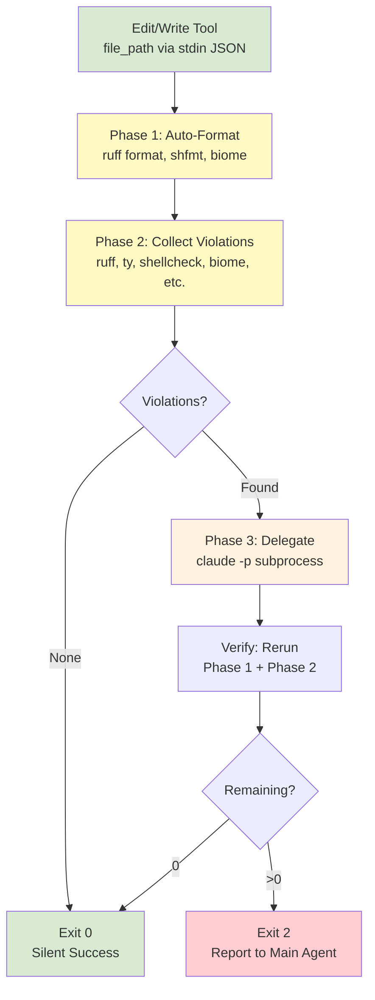
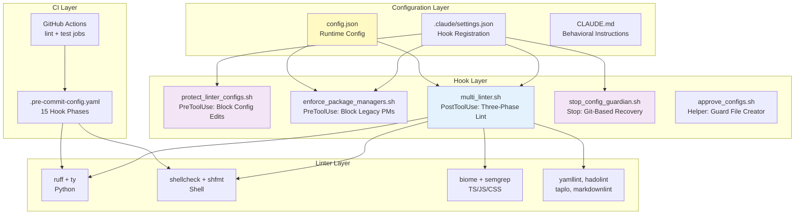

# Plankton - Architecture Overview

## TL;DR

- **Purpose**: Reusable template (Plankton) for automated code
  quality enforcement via Claude Code hooks
- **Scope**: Hook scripts (`.claude/hooks/`), linter configs,
  CI/pre-commit pipelines
- **Key responsibilities**:
  - Three-phase linting (format, collect, delegate)
    on every Edit/Write
  - Defense-in-depth config protection
    (PreToolUse block + Stop hook recovery)
  - Complexity-based model selection (haiku/sonnet/opus) for subprocess delegation
- **Package manager enforcement**: Blocks legacy package managers
  (pip, npm, yarn) and suggests project-preferred alternatives (uv, bun)
- **Languages**: Python, Shell, YAML, JSON, TOML, Markdown, Dockerfile, TypeScript/JS/CSS
- **Dependencies**: `jaq` + `ruff` required; 20+ optional
  linters skipped if absent

## Scope & Context

- **Goals**: Portable, zero-violation baseline with
  automated enforcement in CC sessions and pre-commit
- **Non-goals**: Runtime app code; IDE integration
  beyond Claude Code; custom linter rule authoring
- **Upstream**: Claude Code runtime (hook lifecycle:
  PreToolUse, PostToolUse, Stop); `claude -p` CLI
- **Downstream**: Adopting projects inherit hooks,
  linter configs, and CI pipeline
- **Operating model**: Bash scripts run synchronously;
  blocks main agent until complete

## System Overview

- **Three-phase linting**: Format -> Collect (JSON)
  -> Delegate + Verify
- **Config protection**: Two-layer defense (PreToolUse
  blocks edits; Stop hook detects via `git diff`)
- **Model routing**: Violation complexity drives
  haiku/sonnet/opus selection
- **Package manager enforcement**: PreToolUse hook
  blocks legacy PMs (pip/npm/yarn) and suggests
  project-preferred alternatives (uv/bun)
- **Dual enforcement**: CC hooks (real-time) +
  pre-commit (commit-time) share linter configs
- **Graceful degradation**: Optional tools skipped
  if absent; only `jaq` and `ruff` required
- **Runtime configuration**: `config.json` controls
  language toggles, phase control, model patterns
- **Session-scoped tools**: jscpd and Semgrep run
  once per session after 3+ files modified
- **Boy Scout Rule**: CLAUDE.md enforces ownership
  of all violations in touched files

## Context Diagram

## Data Flow Diagram

## System Overview Diagram

## Core Components

### multi_linter.sh (PostToolUse Hook)

- **Location**: `.claude/hooks/multi_linter.sh` (~1,319 lines)
- **Responsibilities**:
  - Dispatches files to language-specific handlers based on extension
  - Runs three-phase lint: format, collect
    violations as JSON, delegate to subprocess
  - Manages session-scoped tools (jscpd, Semgrep) via `/tmp` marker files
  - Selects subprocess model (haiku/sonnet/opus) based on violation codes and count
- **Implementation**:
  - Reads `config.json` at startup for language toggles, phase control, model patterns
  - Collects violations into a unified JSON array
    `{line, column, code, message, linter}`
  - Spawns `claude -p` with no-hooks settings to
    prevent recursion
  - Verification pass re-runs Phase 1 + Phase 2 after subprocess exits
- **Inputs**: stdin JSON `{"tool_input": {"file_path": "..."}}` from Claude Code
- **Outputs**: Exit 0 (clean) or exit 2 + stderr message (violations remain)
- **Delivery**: Exit 2 + stderr output is delivered to the model as a
  `<system-reminder>` tag embedded inside the `tool_result.content` string
  (confirmed via mitmproxy 3/3 iterations; JSONL format does not capture
  the tag wrapper)

### protect_linter_configs.sh (PreToolUse Hook)

- **Location**: `.claude/hooks/protect_linter_configs.sh` (~87 lines)
- **Responsibilities**: Blocks Edit/Write on protected config files and hook scripts
- **Implementation**: Extracts file path from stdin
  JSON, matches against `config.json` protected list
  or `.claude/` patterns. Returns block or approve
- **Notes**: Fires on all Edit/Write; fast-path
  approval for non-protected files

### stop_config_guardian.sh (Stop Hook)

- **Location**: `.claude/hooks/stop_config_guardian.sh` (~158 lines)
- **Responsibilities**: Detects modified config files
  at session end; prompts user to keep or restore
- **Implementation**: `git diff --name-only` (no LLM).
  Hash-based guard file prevents re-prompting within
  session. `stop_hook_active` flag prevents loops
- **Notes**: `approve_configs.sh` creates guard file
  with SHA-256 content hashes

### config.json (Runtime Configuration)

- **Location**: `.claude/hooks/config.json` (~81 lines)
- **Responsibilities**: Central config for all hooks -
  language toggles, protected files, exclusions,
  phase control, model patterns, jscpd settings,
  package manager enforcement
- **Implementation**: Loaded by `load_config()`;
  parsed with `jaq`. Falls back to defaults if missing
- **`cc_tested_version`**: Tracks the CC CLI version
  against which the hook was last verified (e.g., `"2.1.50"`)
- **TypeScript sub-options**: `biome_unsafe_autofix`
  (unsafe Biome fixes), `oxlint_tsgolint` (oxlint
  integration), `tsgo` (TypeScript Go compiler),
  `knip` (dead code detection) - all opt-in
- **Package manager section**: `package_managers.python`
  (uv/uv:warn/false), `package_managers.javascript`
  (bun/bun:warn/false), `allowed_subcommands` per tool
- **Notes**: Env vars (`HOOK_SUBPROCESS_TIMEOUT`,
  `HOOK_SKIP_SUBPROCESS`) override config values

### enforce_package_managers.sh (PreToolUse Hook)

- **Location**: `.claude/hooks/enforce_package_managers.sh` (~485 lines)
- **Responsibilities**: Intercepts legacy package manager
  commands in Bash tool and blocks or warns, suggesting
  project-preferred alternatives (uv for Python, bun for JS)
- **Implementation**: Reads `config.json` `package_managers`
  section for enforcement mode (block/warn/off) and allowed
  subcommands. Extracts command from stdin JSON, matches
  against legacy PM patterns (pip, npm, yarn, pnpm, poetry,
  pipenv). Returns block with replacement suggestion or approve
- **Notes**: `HOOK_SKIP_PM=1` bypasses all enforcement;
  `HOOK_DEBUG_PM=1` logs matching decisions; `HOOK_LOG_PM=1`
  logs to `/tmp/.pm_enforcement_<pid>.log`

### test_hook.sh (Debug/Test Utility)

- **Location**: `.claude/hooks/test_hook.sh` (~1,436 lines)
- **Responsibilities**: Self-test suite covering all
  file types, model selection, TS handling, config
  protection, and edge cases
- **Implementation**: `--self-test` runs tests with
  `HOOK_SKIP_SUBPROCESS=1` for determinism. 112 cases
  including Dockerfile, model selection, TS tests

## Data Model

- **Violation schema**: `{line, column, code,
  message, linter}` — all handlers convert to this
  format during Phase 2 collection (see `multi_linter.sh`)
- **Hook input**: `{"tool_input": {"file_path": string}}` from Claude Code via stdin
- **PreToolUse output**: `{"decision": "approve"|"block", "reason"?: string}`
- **Stop output**: `{"decision": "approve"|"block",
  "reason"?, "systemMessage"?}`
- **Guard file**: `/tmp/stop_hook_approved_${PPID}.json`
  with `{approved_at, files: {path: "sha256:hash"}}`
- **Session markers**: PPID-scoped files in `/tmp/`
  for jscpd, semgrep, and biome path caching

## Operations

- **Environments**: Local dev with Claude Code;
  CI via GitHub Actions (`lint` + `test` jobs)
- **Configuration**: `config.json` for hooks;
  `.claude/settings.json` for registration;
  `.claude/settings.local.json` for overrides
- **Observability**: `HOOK_DEBUG_MODEL=1` for model
  selection; `HOOK_SKIP_SUBPROCESS=1` skips delegation;
  `--self-test` for automated validation
- **CI/CD**: GitHub Actions runs pre-commit (lint)
  - pytest (test) on push/PR to main
- **Package management**: `uv` for Python;
  `bun` for Node tools (biome, oxlint, markdownlint)

## Security & Privacy

- **Config immutability**: Two-layer defense prevents
  weakening linter rules (PreToolUse + Stop recovery)
- **Subprocess isolation**: `subprocess-settings.json`
  disables hooks; output discarded (`>/dev/null 2>&1`)
- **Security scanning**: Bandit + Semgrep detect common
  vulnerabilities; test paths excluded to reduce noise
- **Path normalization**: Absolute paths normalized via
  `CLAUDE_PROJECT_DIR` for consistent exclusion matching
- **Atomic file ops**: Settings auto-creation uses
  `mktemp + mv` for concurrent safety

## Performance & Capacity

- **Phase 1 target**: <500ms for auto-formatting
  (ruff format handles 250k lines in ~100ms)
- **Subprocess timing**: Haiku ~5s, Sonnet ~15s,
  Opus ~25s per delegation
- **Session-scoped tools**: jscpd/Semgrep deferred
  until 3+ files edited to avoid per-file overhead
- **Biome caching**: Path cached in
  `/tmp/.biome_path_${SESSION_PID}` per session
- **Subprocess timeout**: 300s default (configurable
  via `HOOK_SUBPROCESS_TIMEOUT`); sends SIGTERM
- **Main agent blocking**: Hooks are synchronous;
  Phase 1-3 cycle blocks the main agent

## Resilience

- **Graceful degradation**: Optional tools checked
  with `command -v`; skipped silently if absent
- **Fail-open**: `jaq` absence exits 0 (not blocking);
  JSON parse failures default to empty arrays
- **Subprocess failures**: Non-zero exit logged as
  `[hook:warning]`; does not block; verify follows
- **Timeout handling**: Exit 124 detected and reported;
  falls back to no-timeout if `timeout` missing
- **Version tolerance**: hadolint < 2.12.0 warns but
  continues; jscpd handles both response formats
- **Guard file lifecycle**: PPID-scoped to prevent
  cross-session interference; hash mismatch re-prompts

## Testing & Quality

See [01-testing-infrastructure.md](01-testing-infrastructure.md)
for the full testing PSF covering all 5 test layers, fixtures,
CI pipeline, and 303+ automated checks.

- **Quick reference**: `bash .claude/hooks/test_hook.sh --self-test`
  (112 cases), `bash .claude/tests/hooks/verify_feedback_loop.sh`
  (28 checks), `bash tests/stress/run_stress_tests.sh` (133 tests)
- **Type safety**: Python 3.11+; ty in Phase 2b;
  ruff with 50+ rule categories in preview mode
- **Shell quality**: ShellCheck max enforcement
  (all optional checks, extended dataflow); shfmt
- **Zero-violation baseline**: Ships with no
  violations; CLAUDE.md enforces Boy Scout Rule

## Dependencies & Contracts

| Dependency | Purpose | Notes |
| --- | --- | --- |
| `jaq` | JSON parsing in hooks | Required; Rust `jq` alternative |
| `ruff` | Python format + lint | Required; 30x faster than Black |
| `claude` CLI | Subprocess delegation | Required for Phase 3 |
| `ty` | Python type checking | Optional; Astral Rust-based |
| `shellcheck` | Shell linting | Optional; `shfmt` for formatting |
| `biome` | TS/JS/CSS lint + format | Optional; via npm/npx/pnpm/bun |
| `yamllint` | YAML linting | Optional; all 23 rules configured |
| `hadolint` | Dockerfile linting | Optional; >= 2.12.0 recommended |
| `taplo` | TOML format + lint | Optional; Rust-based |
| `markdownlint-cli2` | Markdown linting | Optional; two-layer enforcement |
| `semgrep` | Security scanning (TS/JS) | Optional; session-scoped advisory |
| `jscpd` | Duplicate detection | Optional; via npx, 5% threshold |
| `vulture` | Dead code detection | Optional; 80% confidence minimum |
| `bandit` | Security scanning (Python) | Optional; config in pyproject.toml |
| `oxlint` | TS/JS type-aware linting | Optional; opt-in via `oxlint_tsgolint` |
| `knip` | Dead code detection (TS/JS) | Optional; opt-in, project-scoped |
| `tsgo` | TypeScript type checking | Optional; opt-in, session-scoped |
| `actionlint` | GitHub Actions linting | Optional; pre-commit only |
| `check-jsonschema` | GHA workflow schema | Optional; pre-commit only |
| `flake8-async` | Async pattern linting | Optional; ASYNC rule codes |
| `uv` | Python package management | Used for `uv run` tool invocation |

## Risks, Tech Debt, Open Questions

- **Shell script size**: `multi_linter.sh` ~1,319
  lines; per-language modules would help
- **Fragile parsing**: yamllint/flake8/markdownlint
  output parsed via `sed`; format changes break it
- **Blocking model**: Synchronous hooks mean Phase 3
  subprocess (up to 300s) blocks main agent
- **Session state in /tmp**: PPID-scoped files rely
  on process hierarchy; restarts cause stale markers
- **TS enabled in project config**: `typescript.enabled:
  true`; requires Biome installed via bun/npm
- **No Windows support**: Bash-based hooks require Unix-like environment
- **macOS `timeout`**: Requires `brew install
  coreutils`; falls back to no timeout if absent

## Benchmark Subsystem

- **Location**: `benchmark/`
- **Purpose**: A/B testing of Plankton hooks against EvalPlus
  HumanEval+ and ClassEval benchmarks to measure hook impact
  on code generation quality
- **Components**:
  - `runner.py` (~582 lines): Orchestrates A/B benchmark runs
    — condition A (baseline, no hooks via `cc -bare`) vs
    condition B (hooks active). Produces JSONL files consumable
    by `evalplus.evaluate`. Supports both HumanEval+ (164 tasks)
    and ClassEval (20 tasks)
  - `analyze.py` (~135 lines): Post-benchmark statistical
    analysis using `scipy.stats.binomtest` for significance
    testing at α=0.05
  - `classeval_wrapper.py` (~90 lines): ClassEval benchmark
    adapter
  - `evalplus_wrapper.py` (~28 lines): EvalPlus benchmark
    adapter
  - `prompt_template.txt` / `classeval_prompt_template.txt`:
    Prompt templates for each benchmark
  - `ClassEval_data.json`: ClassEval task definitions
  - `prereqs.sh`: Prerequisite installation script
- **Dependencies**: `scipy`, `evalplus`, Claude CLI
- **Test coverage**: `tests/unit/test_runner.py` (416 lines),
  `tests/unit/test_analyze.py` (170 lines),
  `tests/unit/test_benchmark_integration.py` (81 lines)
- **Spec**: `docs/specs/adr-plankton-benchmark.md`

## Supporting Files

- **`docs/REFERENCE.md`**: Detailed hook system documentation
  with architecture diagrams, message flow, configuration
  reference, and testing guides
- **`scripts/setup.py`**: Interactive setup wizard that auto-detects
  project stack and generates `config.json`
- **`scripts/init-typescript.sh`**: Initializes
  TypeScript support (installs Biome, creates configs)
- **`tests/stress/run_stress_tests.sh`**: Stress test
  suite for hook performance under load
- **`.claude/tests/hooks/`**: Integration test suite
  infrastructure (103 tests across 3 agents, JSONL results)
  plus diagnostic scripts (see Testing & Quality)
- **`docs/specs/adr-*.md`**: Architecture Decision Records
  (hook schema, package manager enforcement, CLI tool
  prefs, TS expansion, hook integration testing,
  versioning + CC compatibility)
- **`docs/specs/posttooluse-issue/make-plankton-work.md`**:
  Executable plan that identified and fixed the
  `rerun_phase2()` garbled-output bug in `multi_linter.sh`;
  also confirmed PostToolUse delivery mechanism via mitmproxy
- **`docs/specs/posttooluse-issue/posttoolusewrite-hook-stderr-silent-drop.md`**:
  Root cause investigation of PostToolUse silent drop hypothesis
- **`docs/specs/posttooluse-issue/cc-trace/`**: mitmproxy
  trace scripts and JSONL evidence used in investigation
- **`docs/specs/stress-test-report.md`**: Results from hook
  stress testing
- **`docs/specs/portable-hooks-template.md`**: Template
  adoption guide
- **`docs/specs/linear-issue-hook-messages.md`**: Hook
  message formatting spec for Linear issue integration
- **`docs/internal/elevator-pitch.md`**: Project elevator
  pitch and positioning
- **`docs/internal/linting-hooks.md`**: Internal hook
  system reference
- **`docs/internal/slop-guard-mascot-research.md`**: Mascot
  design research

## Glossary

- **Boy Scout Rule**: Editing a file makes you
  responsible for all its violations
- **Phase 1/2/3**: Auto-format, collect violations,
  delegate to subprocess + verify
- **PostToolUse**: CC hook event fired after
  Edit/Write completes
- **PreToolUse**: CC hook event fired before
  Edit/Write executes; can block
- **Stop hook**: CC hook event fired when session
  ends; can block exit
- **Guard file**: PPID-scoped JSON in `/tmp` storing
  SHA-256 hashes of approved config modifications
- **Session-scoped**: Tools (jscpd, Semgrep) that
  run once per session after a file count threshold
- **SFC**: Single-File Components (`.vue`, `.svelte`,
  `.astro`) — Semgrep-only coverage
- **Subprocess delegation**: Spawning `claude -p`
  to autonomously fix collected violations
- **Volume threshold**: Violation count (default 5)
  above which opus model is selected
