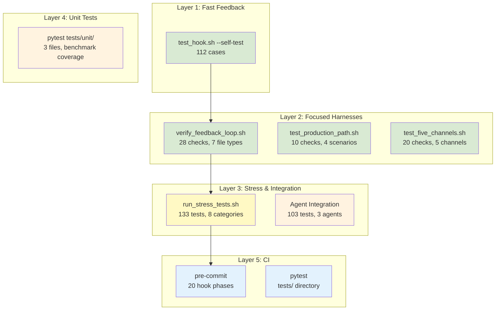

# Testing Infrastructure - Architecture Overview

## TL;DR

- **Purpose**: Multi-layered test infrastructure validating
  Claude Code hook behavior across all file types, output
  channels, subprocess delegation, and CI pipelines
- **Scope**: `.claude/hooks/test_hook.sh`, `.claude/tests/hooks/`,
  `tests/stress/`, `.github/workflows/ci.yml`, `.pre-commit-config.yaml`
- **Key responsibilities**:
  - Self-test suite (112 cases) for fast per-change validation
  - Standalone harnesses for feedback loop, production path,
    and output channel verification
  - Stress test suite (133 cases) with TAP output and
    markdown report generation
  - CI pipeline: pre-commit (lint) + pytest (test) on push/PR
- **Test totals**: 112 + 28 + 10 + 20 + 133 = 303 automated
  checks (+ 103 agent-based integration tests)
- **Dependencies**: ShellCheck, ruff, jaq, yamllint, hadolint,
  taplo, markdownlint-cli2; biome optional

## Scope & Context

- **Goals**: Catch regressions in hook behavior, validate
  violation JSON schema, ensure subprocess delegation works,
  verify all PostToolUse output channels
- **Non-goals**: Testing the Claude Code runtime itself;
  testing linter rule correctness; end-to-end LLM behavior
  verification (that requires mitmproxy live tests)
- **Upstream**: Hook scripts (multi_linter.sh,
  protect_linter_configs.sh, enforce_package_managers.sh,
  stop_config_guardian.sh) provide the system under test
- **Downstream**: CI pipeline consumes pre-commit + pytest;
  `docs/specs/stress-test-report.md` captures stress results
- **Operating model**: Hook tests are bash scripts run locally
  or in CI; pytest unit tests cover the benchmark subsystem
  (`tests/unit/test_runner.py`, `test_analyze.py`,
  `test_benchmark_integration.py`)

## System Overview

- **Five test layers**: self-test, feedback loop, production
  path, five-channel, stress test
- **Fixture isolation**: Shared config fixtures in
  `.claude/tests/hooks/fixtures/` decouple tests from
  production config
- **TAP output**: Stress tests emit Test Anything Protocol
  for machine-readable results
- **Agent integration**: 103 tests via three TeamCreate agents
  (dep-agent 29, ml-agent 42, pm-agent 32)
- **CI automation**: GitHub Actions runs pre-commit + pytest
  on push/PR to main

## Test Layer Diagram

## Core Components

### test_hook.sh (Self-Test Suite)

- **Location**: `.claude/hooks/test_hook.sh` (~1,436 lines)
- **Invocation**: `bash .claude/hooks/test_hook.sh --self-test`
- **Test count**: 112 pass / 0 fail
- **Implementation**: `run_self_test()` orchestrates all tests
  using three helpers: `test_temp_file()` (exit code checks),
  `test_bash_command()` (PM hook JSON I/O), and
  `_create_mock_path_without()` (tool unavailability mocks)
- **Coverage areas**:
  - File type detection and handler dispatch (Dockerfile,
    Python, Shell, JSON, YAML, TOML, Markdown, TypeScript)
  - Model selection (haiku/sonnet/opus based on violation codes)
  - TypeScript handling (biome, oxlint, SFC, CSS, disabled config)
  - Package manager enforcement (block/warn/bypass modes)
  - Feedback loop regression tests (JSON schema, exit codes)
  - Structural guards (jaq merge/conversion protection counts)
- **Environment**: Runs with `HOOK_SKIP_SUBPROCESS=1` for
  determinism; uses `fixture_project_dir` with shared config

### verify_feedback_loop.sh

- **Location**: `.claude/tests/hooks/verify_feedback_loop.sh`
  (209 lines)
- **Invocation**: `bash .claude/tests/hooks/verify_feedback_loop.sh`
- **Test count**: 28 pass / 0 fail / 4 skip (biome)
- **Purpose**: Validates multi_linter.sh stderr output format
  for all file types under `HOOK_SKIP_SUBPROCESS=1`
- **4 assertions per file type**:
  1. Exit code == 2
  2. `[hook]` prefix present in stderr
  3. Valid JSON array (parseable by jaq)
  4. Array length >= expected minimum
- **File types**: Python (ruff), Shell (shellcheck), JSON
  (syntax), YAML (yamllint), Dockerfile (hadolint), TOML
  (taplo), Markdown (markdownlint-cli2), TypeScript (biome)
- **Gating**: Each linter checked with `command -v`; missing
  linters skip 4 checks with reason logged

### test_production_path.sh

- **Location**: `.claude/tests/hooks/test_production_path.sh`
  (275 lines)
- **Invocation**: `bash .claude/tests/hooks/test_production_path.sh`
- **Test count**: 10 pass / 0 fail
- **Purpose**: Tests subprocess delegation with mock `claude`
  binaries (no real LLM calls)
- **4 scenarios**:
  1. Subprocess fixes nothing → exit 2 + violations remain
     - `[hook:feedback-loop]` marker
  2. Subprocess fixes all → exit 0
  3. `claude` not in PATH → exit 2 + "not found" message
  4. Delegation disabled via config → exit 2 + mock not called
- **Isolation**: Uses `isolated_home` in temp dir to prevent
  production config interference

### test_five_channels.sh

- **Location**: `.claude/tests/hooks/test_five_channels.sh`
  (553 lines)
- **Invocation**: `bash .claude/tests/hooks/test_five_channels.sh`
  or `--runbook` for mitmproxy instructions
- **Test count**: 20 pass / 0 fail
- **Purpose**: Tests 5 PostToolUse output channels with
  minimal hook scripts (one per channel)
- **Channels**: stderr+exit2, stderr+exit1, JSON stdout+exit2,
  JSON stdout+exit0, stderr+exit0
- **4 assertions per channel**: exit code, correct stream,
  content match, other stream empty
- **Runbook mode**: Prints step-by-step mitmproxy verification
  instructions for each channel

### run_stress_tests.sh

- **Location**: `tests/stress/run_stress_tests.sh` (2,335 lines)
- **Invocation**: `bash tests/stress/run_stress_tests.sh`
- **Test count**: 133 tests (125 pass, 8 skip)
- **Output**: TAP format to stdout + markdown report at
  `docs/specs/stress-test-report.md`
- **8 categories**:
  - **A** Language Handlers (50): all file types + linter combos
  - **B** Model Selection (14): haiku/sonnet/opus routing
  - **C** Config Toggles (12): language enable/disable
  - **D** PreToolUse Protection (21): config file blocking
  - **E** Stop Hook (8): lifecycle + guard files
  - **F** Session-Scoped (8): PPID isolation, parallel sessions
  - **G** Edge Cases (15): missing tools, graceful degradation
  - **H** Performance (5): <2000ms per file type

### Test Fixtures

- **Location**: `.claude/tests/hooks/fixtures/`
- **Files**:
  - `config.json` (79 lines): Maximal config with all languages
    and options enabled; includes `_exclusions_warning` for
    `.claude/` skip trap documentation
  - `.markdownlint.jsonc`: Markdown linting rules
  - `.markdownlint-cli2.jsonc`: Markdownlint-cli2 config
- **Design**: Decouples tests from production `.claude/hooks/config.json`;
  all test helpers set `CLAUDE_PROJECT_DIR` to a temp dir
  containing copies of these fixtures

### Test Utilities

- **swap_settings.sh** (108 lines): Backup/restore helper
  for `.claude/settings.json` with SHA-256 verification.
  4 subcommands: `backup`, `swap-minimal`, `restore`, `status`
- **minimal-test-hook.sh** (4 lines): Stub PostToolUse hook
  that always exits 2 with 3 violations. Used to isolate
  whether the agent ignores system-reminder regardless of
  hook complexity

## Data Model

- **Test input**: JSON `{"tool_input": {"file_path": "..."}}` piped
  to hook stdin (same format Claude Code uses)
- **Test assertions**: Exit code + stderr content + JSON validity
- **TAP format**: `ok N - description` / `not ok N - description`
  with skip directives
- **Agent results**: JSONL files per agent in
  `.claude/tests/hooks/results/` with markdown aggregation
- **Fixture config schema**: Mirrors production `config.json`
  with all features enabled for maximum coverage

## Operations

- **Local fast check**: `bash .claude/hooks/test_hook.sh --self-test`
  (~30s, 112 tests)
- **Full local suite**: Run all 4 harnesses sequentially (~2 min,
  170 tests + 4 skip)
- **Stress test**: `bash tests/stress/run_stress_tests.sh` (~5 min,
  133 tests, generates report)
- **CI**: GitHub Actions runs `uv run pre-commit run --all-files`
  (lint) + `uv run pytest tests/` (test) on push/PR to main
- **Environment variables**:
  - `HOOK_SKIP_SUBPROCESS=1`: Bypass Phase 3 delegation
    (used by self-test and feedback loop harness)
  - `HOOK_DEBUG_MODEL=1`: Log model selection reasoning
  - `HOOK_SKIP_PM=1`: Bypass package manager enforcement
  - `CLAUDE_PROJECT_DIR`: Override project root for config lookup

## Testing & Quality

- **Pre-commit pipeline**: 20 hook phases mirroring CC hook
  linters; runs `uv run pre-commit run --all-files`
- **Agent integration tests**: 103 tests via TeamCreate (3 agents);
  results archived in `.claude/tests/hooks/results/archive/`
- **Regression workflow** (from `docs/tests/README.md`):
  1. Self-test: `bash .claude/hooks/test_hook.sh --self-test`
  2. Feedback loop: `bash .claude/tests/hooks/verify_feedback_loop.sh`
  3. Production path: `bash .claude/tests/hooks/test_production_path.sh`
  4. Five channels: `bash .claude/tests/hooks/test_five_channels.sh`
- **Mitmproxy live test**: Manual rank-1 verification using
  `HTTPS_PROXY=http://localhost:8080` to confirm system-reminder
  delivery to the model (see `make-plankton-work.md` Step 2)

## Dependencies & Contracts

| Dependency | Required by | Notes |
| --- | --- | --- |
| `jaq` | All harnesses | JSON parsing in assertions |
| `ruff` | Self-test, feedback loop, stress | Python linting |
| `shellcheck` | Self-test, feedback loop, stress | Shell linting |
| `yamllint` | Feedback loop, stress | Optional; skipped if absent |
| `hadolint` | Feedback loop, stress | Optional; skipped if absent |
| `taplo` | Feedback loop, stress | Optional; TOML fixtures in project tree |
| `markdownlint-cli2` | Feedback loop, stress | Optional; needs config file |
| `biome` | Self-test, feedback loop | Optional; TS tests skip if absent |
| `mitmproxy` | Live verification | Manual only; rank-1 evidence |
| `uv` | CI | `uv run pre-commit`, `uv run pytest` |

## Resilience

- **Graceful degradation**: All harnesses gate on `command -v`
  for optional linters; missing tools produce skips, not failures
- **Fixture isolation**: Tests never read production config;
  `fixture_project_dir` with shared fixtures prevents
  cross-contamination
- **HOME isolation**: `test_production_path.sh` uses
  `isolated_home` in temp dir to prevent writes to real
  `~/.claude/`
- **TOML workaround**: taplo resolves include globs from CWD;
  TOML fixtures placed in project tree with EXIT trap cleanup
- **Cleanup**: All harnesses use `trap cleanup EXIT` on temp dirs

## Risks, Tech Debt, Open Questions

- **Pytest unit tests**: `tests/unit/` contains 3 test files
  (test_runner.py, test_analyze.py, test_benchmark_integration.py)
  covering the benchmark subsystem; hook testing remains shell-based
- **Stress test size**: `run_stress_tests.sh` at 2,335 lines
  is complex; per-category modules would help
- **Agent tests require TeamCreate**: 103 integration tests
  need Claude Code team orchestration; not runnable in CI
- **Stop hook untestable**: `stop_config_guardian.sh` requires
  session lifecycle events that cannot be simulated
- **TOML fixture leak risk**: Placing TOML files in project tree
  (taplo CWD limitation) risks git pollution if cleanup fails
- **Biome availability**: 4 skip count depends on biome
  installation; TS coverage gaps on systems without it

## Supporting Files

- **`docs/tests/README.md`**: Testing reference with manual
  hook testing, environment variables, integration test
  workflow, and regression testing commands
- **`docs/specs/adr-hook-integration-testing.md`**: ADR for
  three-agent TeamCreate integration test architecture
- **`docs/specs/stress-test-report.md`**: Generated stress
  test results (133 tests, 8 categories)
- **`.claude/tests/hooks/results/`**: Agent integration test
  JSONL results and aggregated RESULTS.md
- **`docs/specs/posttooluse-issue/make-plankton-work.md`**:
  Live verification procedure (Step 2) with mitmproxy

## Glossary

- **TAP**: Test Anything Protocol — machine-readable test output
  format (`ok N` / `not ok N`)
- **Feedback loop**: PostToolUse exit 2 + stderr → system-reminder
  → model reads violations → model Edits to fix
- **Gating**: Checking `command -v` before running linter-specific
  tests; skip if tool absent
- **fixture_project_dir**: Temp directory with copies of
  `.claude/tests/hooks/fixtures/` config files, used as
  `CLAUDE_PROJECT_DIR` during tests
- **Mock claude**: Fake `claude` binary in test PATH that
  simulates subprocess behavior without LLM calls
- **Runbook mode**: `--runbook` flag on test_five_channels.sh
  that prints mitmproxy verification steps instead of running
  automated checks
